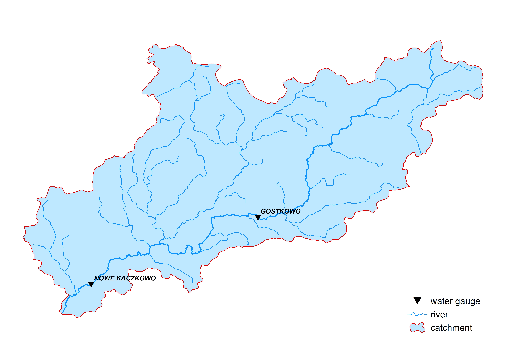
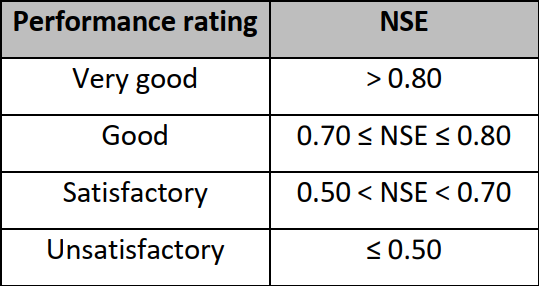
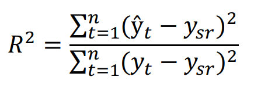
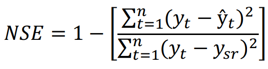

### PROJECT GOAL
The aim of the project is to assess the usefulness of machine learning models in the application of time series, i.e. sequences of values (observations) that are associated with specific moments in time. In a single-factor time series, one observation is associated with each moment of time, e.g. discharge or water level. The tasks that are most often performed in relation to time series are analysis and forecasting. Analysis consists in discovering certain patterns and regularities in the data that will allow for its better understanding. Forecasting is the prediction of future values based on observed values. Forecasting was used in this project. The project uses hydrometric data, water levels (H) and discharges (Q), published on the website https://danepubliczne.imgw.pl/. The data of analyzed catchment included time series of daily water levels and discharges in water gauge profiles of the Brok river: NOWE KACZKOWO and GOSTKOWO (fig. 1). The analyzed period covered the years 1981 – 2004. The water levels and discharges in the examined gauge profiles were predicted based on data obtained from the water gauge located either above or below the analyzed one. Two cases were distinguished: 
- CASE 1: Forecasting discharges and water levels for the Nowe Kaczkowo station, assuming that this water gauge profile represents an incomplete set of data
- CASE 2: Forecasting discharges and water levels for the Gostkowo station, assuming that this water gauge profile represents an incomplete set of data

 

The consistency of the obtained results was assessed using the coefficient of determination (R2) and the efficiency coefficient of the Nash-Sutcliffe (NSE) model, which is often used to assess the predictive capabilities of hydrological models. The value of the NSE coefficient can take values - ∞ to 1, and the closer the value of the coefficient to 1, the better the model describes reality. The efficiency coefficient values of the Nash-Sutcliffe model are presented below.

 

Mathematical formulas for coefficients used in the project:

where:
- yt - observed discharge or water level value
- $\hat{y}$</hat>t - predicted discharge or water level value
- ysr - average discharge or water level value

For the sake of clarity, the project has been divided into 2 parts. The first part encompasses data processing and machine learning models for discharges analysis - the file "BROK_part1_DISCHARGE(Q).ipynb". The second part concerns water levels modeling - the file "BROK_part2_WATER_LEVEL(H).ipynb".
